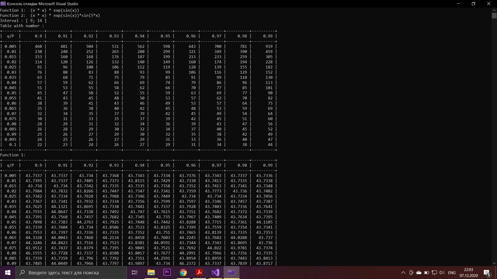

# Лабораторная работа №2 по Теории систем и системному анализу
Вариант 16
## Задание
1. На интервале [9; 14] задана унимодальная функция одного переменного f(x) = (x * x) * exp(sin(x)).
   Используя метод случайного поиска осуществить поиск минимума f(x) с заданной вероятностью
   попадания в окрестность экстремума P при допустимой длине интервала неопределенности E.
   Определить необходимое число испытаний N. Численный эксперимент выполнить для значений
   P = 0,90, 0,91,..., 0,99
   и значений E = (b - a) * q, где q = 0,005, 0,010,..., 0,100.
2. При аналогичных исходных условиях осуществить поиск минимума f(x), модулированной сигналом
   sin(5x), т.е. мультимодальной функции f(x)*sin(5x).
   
## Выполнение
Код файла, реализующего функцию случайного поиска, а также представляющего результаты в виде таблицы, приведен в main.cpp

")
*sin(5x)")
